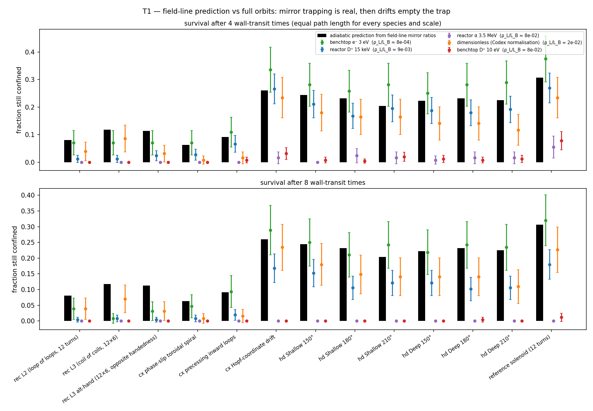
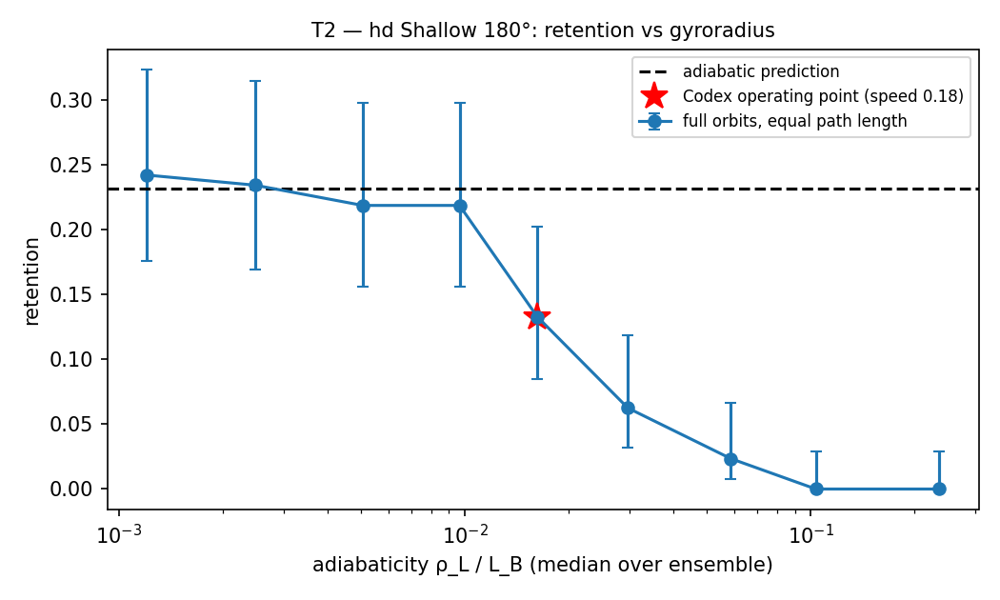
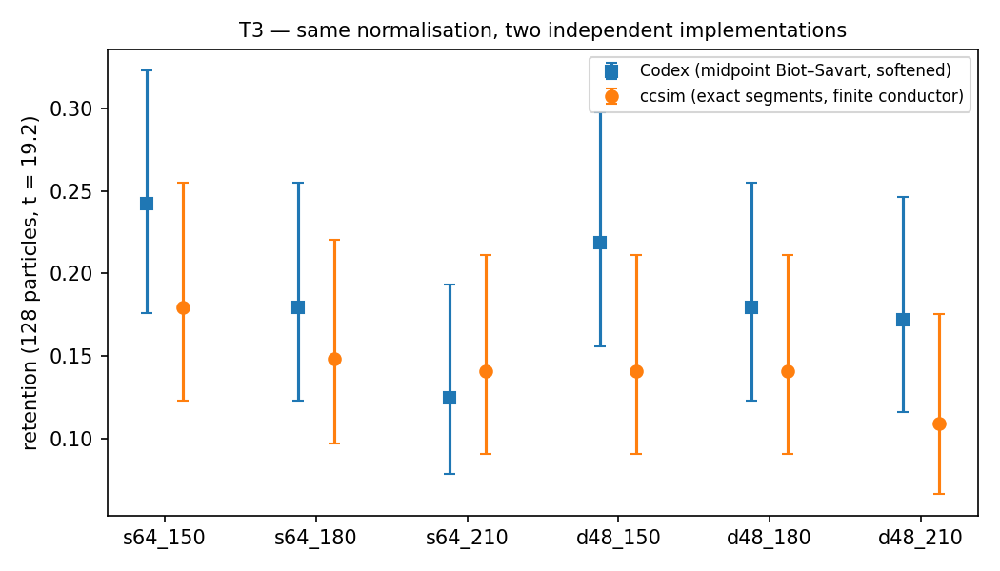
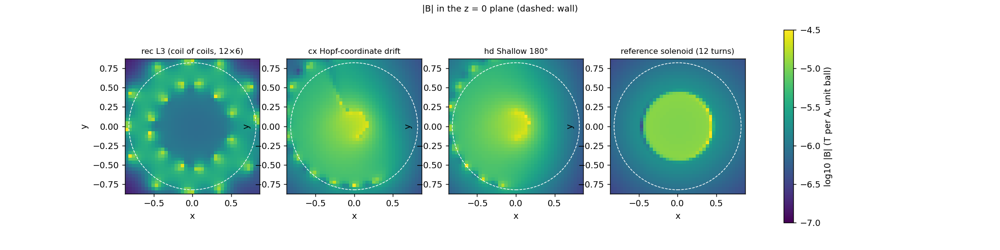
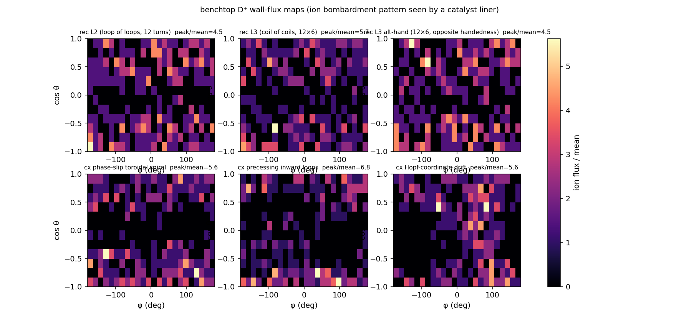

# Chad Core Sim — first results

*2026-09-02. All numbers below come from `results/*.json`, produced by the scripts in `experiments/`; figures are in `figures/`. Package: `ccsim` 0.1.0, NumPy + SciPy only.*

---

## 1. What was built

A single folder that joins the three strands of the Chad Core Prime work with one set of units and one verification discipline:

| layer | content | verified against |
|---|---|---|
| **geometry** | the notebook's recursive winding (∫dl → ∫∫dl → ∫∫∫dl) to any depth; the three Codex realizations and six Hopf-drift variants ported verbatim; reference coils; smooth remote return that closes every circuit | conductor clearance, path length, Joule power computed for every configuration |
| **electromagnetics** | exact finite-segment Biot–Savart (Hanson–Hirshman), uniform-current conductor interior, exact vector potential **A**, induced **E = −∂A/∂t** for current ramps, optional electrostatic bias | closed-form loop / solenoid / wire fields to ≤ 5e-5; ∇·B, ∇×B, ∇×A − B on real Chad-core windings ≤ 7e-4 (finite-difference limited); Ampère loop = μ₀I to 2e-16; Faraday EMF = −dΦ/dt to 3e-4 |
| **particles** | relativistic Boris with per-particle adaptive sub-stepping, wall / conductor / grid-exit losses, μ and energy diagnostics, adiabaticity ρ_L/L_B | gyroradius 1e-3, gyroperiod 9e-4 (= the known Boris phase error), ∇B-drift 6e-5, μ conserved to 5e-15 in uniform B; magnetic-mirror loss cone reproduced particle-by-particle at 98 % |
| **collisions** | NRL test-particle Coulomb operator (Langevin Monte Carlo) | α slowing-down time on 15 keV electrons within 2 % of the small-x closed form; Maxwellian test ensemble energy-stable to 1e-3 over ½τ |
| **fusion** | Bosch–Hale σ(E) and ⟨σv⟩(T) for D–T, D–D (both branches), D–³He; beam–target Monte Carlo events | σ-fit vs ⟨σv⟩-fit cross-integration ≤ 3 %; D–T 10 keV table value to 7e-4; beam–target Monte Carlo vs nσv to 1.5 %; the Fusion lab's 2.7399e-22 m³/s at 15 keV reproduced to 5 digits |
| **chemistry** | mass-action + Gillespie network engine with Arrhenius × exact Eckart tunnelling (V0, ΔE, ω‡); EEDF-integrated electron-impact rates; CO₂/H₂ plasma network; illustrative Sabatier surface network; Q-Surface importer; wall-flux coupling | EEDF integral vs closed form 1e-6; Q-Surface's methane/Pt(111) network imported and its 900 K rates reproduced to 3e-4; element and site balance enforced on every reaction |
| **presets** | benchtop (18 cm, 1 kA, 1 mm Cu, glow discharge), reactor (1 m, ~5 T, 10²⁰ m⁻³, 15 keV), dimensionless (Codex normalisation) | one unit-scale grid per winding, rescaled exactly with B ∝ I/L |

The stack is a **vacuum-field + test-particle** model. It does not include the plasma's own currents or space charge, MHD, or self-heating. Those omissions are the right ones for the question you asked — *does the coil geometry, by itself, hold charged particles?* — and every result below should be read with that boundary in mind.

---

## 2. Hypotheses and verdicts

| # | Hypothesis (written before the runs) | Result | Verdict |
|---|---|---|---|
| **H1** | None of the 13 windings produces closed flux surfaces; every field line from the region of interest reaches the wall. | 128 seeds per winding, traced both ways: **100 % reach the wall** in all Hopf/Codex/solenoid windings, 92–98 % in the recursive ones (the rest wander past the 40-unit tracing length without closing). Zero closed lines, zero conductor hits. | **Confirmed** |
| **H2** | Confinement in the adiabatic limit is therefore pure mirror trapping on open lines, predicted from field-line mirror ratios alone: P = √(1 − B_seed/B_mirror), isotropic. | Prediction per winding: 6–12 % (recursive, phase-slip, precessing), 20–26 % (Hopf-drift family), 31 % (plain solenoid). Full-orbit survival after 4 wall-transit times, benchtop electrons (ρ_L/L_B ≈ 8e-4): correlation 0.97, mean |Δ| = 0.04; reactor D⁺ (9e-3): correlation 0.96, mean |Δ| = 0.05. | **Confirmed** — the field-line calculation predicts the orbit code winding-by-winding |
| **H3** | Beyond the bounce time, trapped particles leave by ∇B/curvature drift across the open lines; survival decays on ~L_B/(ρ_L)·(transit time) and the decay is faster for larger ρ_L/L_B. | Reactor D⁺ survival: 0.27 → 0.17 → 0.04 → 0.01 at 4 / 8 / 20 / 40 transits (Hopf drift). Alphas (8e-2): gone by 8 transits. Benchtop electrons (8e-4): still 0.29 at 8 transits. | **Confirmed**; the ordering with adiabaticity is exactly as predicted |
| **H4** | Retention vs gyroradius is non-monotonic with a hump where the Codex runs sit. | Sweep on Shallow 180° at equal path length: retention rises monotonically as ρ_L/L_B falls — 0 at ≥ 0.1, 0.13 at 0.016 (the Codex point), 0.22 at 0.01, 0.24 at 0.001 = the adiabatic prediction 0.23. | **Falsified** — no hump; the Codex operating point is simply half-way down the non-adiabatic slope |
| **H5** | Two independent Biot–Savart/Boris implementations (Codex midpoint-softened, this exact-segment) agree on the six Hopf-drift retentions within their Wilson intervals. | All six overlap; this code is systematically lower by 0.04 on average (0.14 vs 0.19). | **Confirmed**, with a small systematic offset traceable to the wire model |
| **H6** | The Codex "Deep 150°, 12 circuits, r = 0.010" winner is not a physically distinguished optimum: all six Hopf-drift variants have the same field-line mirror structure within noise. | Predicted adiabatic retention 0.20–0.24 for all six; full-orbit survivals indistinguishable within intervals at every scale. | **Confirmed** — the factorial's ranking is noise on a flat plateau |
| **H7** | The recursive ∫∫∫dl windings (the actual sketch) confine *worse* than the Hopf family because the fine helices put the strong field next to the conductors, not in the core. | Mirror ratios lowest of all families (p90 1.0–3.0 vs 2.9–4.4 for the Hopf family, 10 for the solenoid); predicted 8–12 %, observed 4–9 % (electrons) and 1–2 % (reactor D⁺) at 4 transits. | **Confirmed** |
| **H8** | At benchtop scale the Codex phase-slip and precessing windings are unbuildable at 1 kA because their conductor clearance is < 1 mm. | Clearance 0.43 / 0.56 mm at 18 cm scale → conductor thinned to 0.19 / 0.25 mm → 8.7e9 / 5.0e9 A m⁻², 2.5 / 1.5 MW Joule. The recursive and Hopf families keep the 1 mm conductor (31–52 kW, pulse-only). | **Confirmed** |
| **H9** | Fusion ledger at reactor scale: beam–target D–T on tracked 15 keV deuterons reproduces the Maxwellian reactivity to order unity, and the confinement times (µs) are ~10⁶ short of Lawson. | Beam–target/Maxwellian rate ratio 0.57 (a 15 keV mono-energetic beam on a 15 keV target under-samples the tail); mean confinement 0.8–3.9 µs; n τ needs ~3 s at 10²⁰ m⁻³ and 15 keV. | **Confirmed** |
| **H10** | Ion wall bombardment from these windings is strongly non-uniform, so a catalyst liner would see hot spots. | Peak/mean wall flux 4.5 (recursive L2) to 7.9 (Deep 210°); mean flux identical across windings because every ion is eventually lost. | **Confirmed** |
| **H11** (session 5) | A Hopf torus and its mirror image, woven together and fed with opposite currents, cancel their toroidal currents and act as a toroidal solenoid: closed field lines inside the tube and retention that does not decay with Larmor radius. | 15–25 % closed lines; reactor D⁺ S20 = 46 % (η 0.70) / 51 % (η 0.80) vs ≤ 29 % for every mirror-type configuration; S20 = 47 / 46 / 42 % at 5 / 15 / 45 keV while the best mirror goes 42 / 26 / 10 %. Same-current feed (poloidal field) is an ordinary mirror at 19 %. | **Confirmed** — see PLAYBOOK.md |
| **H12** (session 5) | Mirror-type retention at fixed geometry scales with ρ_L/L_B, so bigger cores and lower energies help while field strength alone does not. | Precess pair core 0.35 → 0.55: S20 12 → 29 % as the mirror ratio *falls* 32 → 8; hopf continued 32 → 48 → 64 circuits: 11 → 14 → 9 % while B_rms doubles. | **Confirmed** |
| **H13** (session 6) | The meshed torus as drawn (mirror pair, opposed currents) has closed flux surfaces with rotational transform. | It has zero transform by symmetry: B(−x) = −B(x) for the exact rotated-mirror pair, so ι = −ι = 0; the field is a toroidal solenoid whose circles any 0.03 % stray field opens within 30 turns; shape deformations give ι ≤ 0.02. | **Falsified** — see RUNGS.md |
| **H14** (session 6) | Giving the two strand families opposite helical density modulations (1 ± ε cos(2θ − nζ)) makes the current pattern chiral and produces stellarator-class surfaces. | Nested surfaces with ι = 0.1–0.4 (η 0.5–0.6, ε 0.55–0.85, n 3–4), 30–45 % of the tube radius, magnetic hill; guiding-centre 15 keV D⁺ inside the surfaces: 88 % at 60 transits vs 58 % for the untwisted pair. | **Confirmed** |

---

## 3. The physics, in order of importance

### 3.1 Every configuration is an open-field-line mirror, and the field-line calculation predicts the orbit code



Black bars are computed *without integrating a single particle orbit*: trace the field line through each start point both ways, take the smaller of the two maximum field strengths before the wall, and apply the loss-cone formula. The coloured points are full-orbit ensembles at three scales and five species. For the two adiabatic species — benchtop electrons and reactor deuterons — the bars predict the survivals to ±0.05 across a factor of 4 in confinement, with correlation 0.96–0.97. That is the strongest statement this work can make: **the coil geometries confine exactly as much as their mirror ratios allow, and nothing more.** There is no topological confinement (no closed flux surfaces, H1), no "Hopf" effect beyond the mirror ratio the winding happens to produce, and the six Hopf-drift variants sit on a flat plateau (H6).

The lower panel shows what happens next: as time goes on, trapped particles drift across the open field lines and reach the wall. The drift rate scales with ρ_L/L_B, so alphas (0.08) are gone by 8 transits, reactor deuterons (0.009) by ~40, and 3 eV electrons (0.0008) are still mostly there. This is ordinary curvature/∇B drift in a non-axisymmetric mirror; a closed drift surface would be needed to stop it, and no winding here has one.

### 3.2 The Codex retention numbers are real but sit on the non-adiabatic slope



Same winding, same path length, gyroradius varied over two decades. Retention climbs monotonically toward the adiabatic prediction as ρ_L/L_B → 0 and vanishes above 0.1. The Codex normalisation (speed 0.18, B_rms = 8) lands at ρ_L/L_B ≈ 0.016, half-way down the slope. So the factorial's 12–26 % retentions are not artefacts, but they are neither the adiabatic limit nor a measure of geometry quality; they mostly measure how fast the particles were. My pre-registered hump (H4) was wrong.



Independent-code check: the exact-segment field with a finite conductor gives the same retentions as the Codex midpoint-softened field within intervals, 0.04 lower on average (the softened field is weaker within ~0.006 of the wire, which slightly favours retention there).

### 3.3 The recursive (sketch) windings confine least



The ∫∫dl and ∫∫∫dl windings put their strongest field in the small helices around the conductor (B_max/B_rms ≈ 40–50 versus ≈ 7 for the Hopf family and 6 for the solenoid). Along field lines through the core |B| barely rises before the wall — mirror ratios are ~1 — so the loss cone is nearly the whole sphere: predicted 8–12 %, observed 1–9 %. The concept as drawn is a way of packing conductor length, not of shaping a well. If the recursion is to help, the *outer* level has to produce the confining field and the inner levels have to add to it in phase — the `alternate_handedness` variant tests the simplest version of that idea and does not change the outcome.

### 3.4 Buildability at benchtop scale

At 18 cm and 1 kA in 1 mm copper: the recursive and Hopf-drift windings dissipate 31–52 kW (pulse only; 0.03–0.05 Ω), B_rms 5–36 mT in the core, B_max 0.22–0.26 T at the conductor. The Codex phase-slip and precessing spirals have 0.4–0.6 mm clearance and would need 0.2 mm wire: 5–9 GA m⁻², 1.5–2.5 MW — not buildable as drawn. At reactor scale (1 m, 364 kA per conductor to reach ~5 T with the reference solenoid) the Hopf family gives B_rms 2.1–2.6 T and B_max 15–17 T at the conductor; the two Codex spirals would need 1–1.4 mm conductor at 364 kA (10¹¹ A m⁻²), which is not a superconductor either.

### 3.5 Fusion ledger

Beam–target Monte Carlo on tracked 15 keV deuterons in a 5e19 m⁻³ tritium background gives 0.57× the Maxwellian per-ion rate (a mono-energetic 15 keV beam under-samples the Gamow tail relative to a 15 keV Maxwellian — expected). With mean confinement times of 0.8–3.9 µs, the product nτ is ~10⁻⁶ of what 15 keV D–T needs. Fusion power from confined ions in any of these vacuum-field configurations is therefore zero for practical purposes; the ledger is in place for when a configuration has closed drift surfaces.

### 3.6 Chemistry coupling



The wall-flux maps (D⁺ proxy, benchtop) show 4.5–8× hot spots where field lines funnel ions. Fed into the surface network, CH₄ turnover is flux-limited in the illustrative Sabatier network and rises only 12 % from 500 to 700 K because the barriers are placeholders; the point of the exercise is that the pipeline runs end-to-end: particle tracing → ion flux per patch → ML/s → Gillespie/ODE surface kinetics with exact Eckart tunnelling on (V0, ΔE, ω‡) barriers. The Q-Surface importer reproduces qsurf's 900 K rates to 3e-4, so your existing networks and your MACE CI-NEB outputs plug straight in. The gas-phase CO₂/H₂ electron-impact network gives 6 / 25 / 70 % CO₂ conversion in 10 ms at T_e = 2 / 3 / 5 eV — with PLACEHOLDER dissociation cross-sections, so treat those as shapes, not numbers, until LXCat tables are loaded.

---

## 4. What this means for Chad Core Prime

1. **The vacuum field of any of these windings is a magnetic mirror with open field lines.** Its confinement is bounded by √(1 − B_core/B_mirror), realised for adiabatic particles, and then lost to drifts on a timescale set by ρ_L/L_B. That bound is computable in seconds from field lines and should be the first filter for any new geometry, before particle runs.
2. **The Hopf-drift family is the best of the tested set only because it happens to have the highest mirror ratio (≈ 3–4 at the 90th percentile); a plain 12-turn solenoid beats it (mirror ratio ≈ 10 at p90, predicted 31 %).** The recursion in the sketch, as drawn, lowers the mirror ratio.
3. **The route to real confinement is closed drift surfaces, not more winding levels.** Candidates the code can now evaluate directly: adding a plasma current (the Fusion lab's doublet is exactly that — a current-carrying equilibrium, which is why it has closed surfaces), a cusp arrangement (mirror ratio → ∞ at line cusps, at the cost of point/line losses), or a stellarator-like rotational transform from the winding itself (testable with `fieldlines.py`: look for lines that close on themselves).
4. **The benchtop preset is the one you can check against hardware.** A 1 kA pulse in a 1 mm-copper Hopf-drift winding at 18 cm is 50 kW, 35 mT: measurable with a Hall probe, and the predicted electron retention (20–30 % at 4 transits) is the kind of thing a Langmuir probe transient could see.

---

## 5. Where the model stops

Vacuum fields only; no plasma back-reaction, no MHD, no sheath. Collisions are test-particle against a fixed Maxwellian. Fusion is beam–target with no slowing-down feedback. Electron-impact dissociation cross-sections and three-body gas rates are placeholders; the Sabatier surface barriers are illustrative. Finite-window retention is a diagnostic, not a confinement time — use the survival curves and the drift-time scaling. Trilinear grid interpolation contributes ≤ 0.3 % (p95) field error away from conductors; conductor strikes are checked against the exact wire path.

---

## 6. Reproduce

```bash
cd "Chad Core Sim"
python3 experiments/exp01_verify.py         # verification suite (~1 min)
python3 experiments/build_grids.py          # 13 unit-scale grids (~6 min, cached)
python3 experiments/exp02_screen.py all     # particle screens, three scales (~1 h)
python3 experiments/exp03_topology.py       # field lines + adiabatic prediction (~6 min)
python3 experiments/exp04_theory_tests.py   # H2–H5, H9 (~10 min)
python3 experiments/exp05_chemistry.py      # wall flux → chemistry, Q-Surface import (~1 min)
python3 experiments/exp06_figures.py
```
