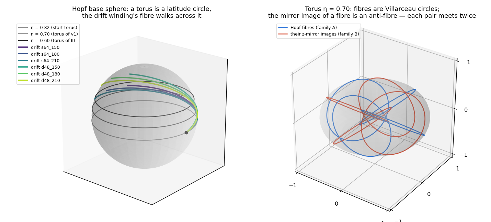
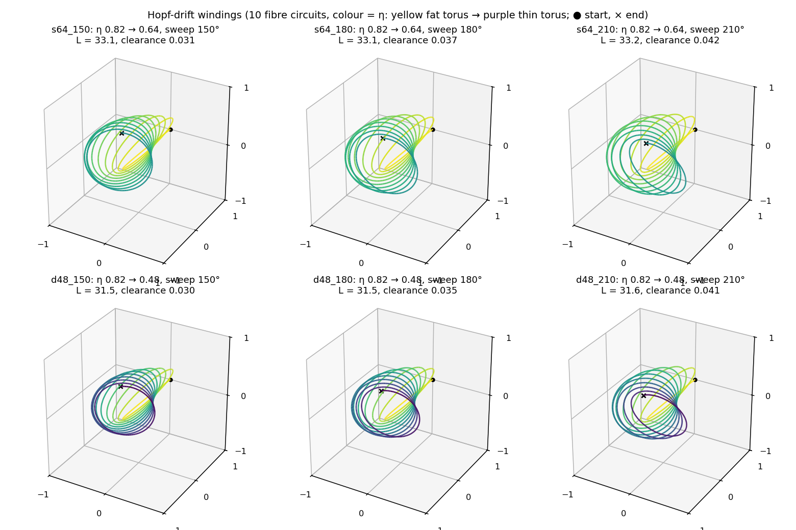
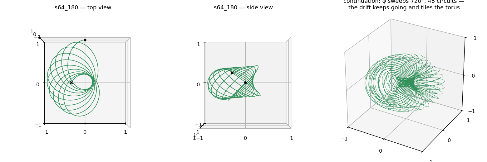
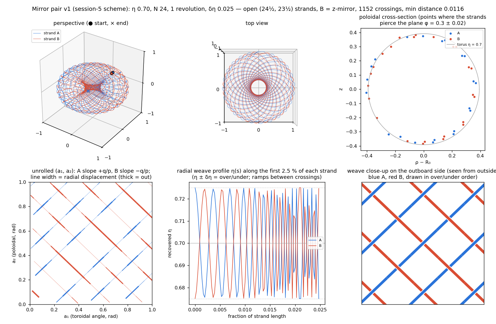
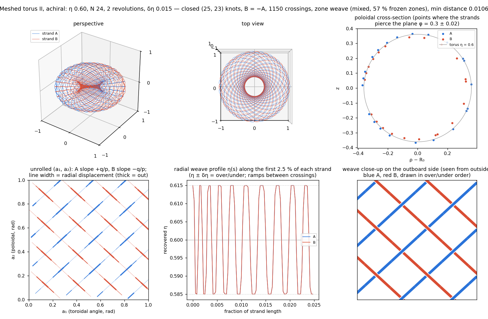
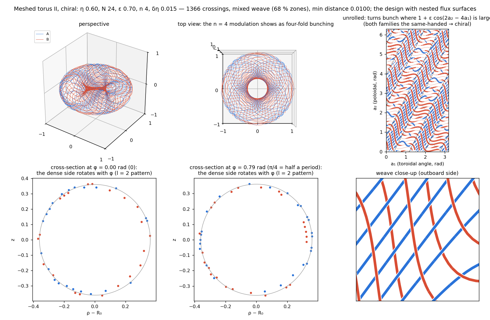
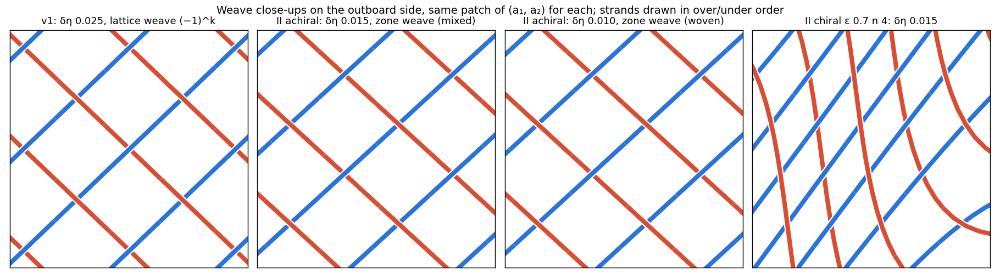

# The Hopf family: the drift winding and the two versions of the Hopf torus + mirror image

This folder pulls three geometries out of `ccsim` as equations, 3-D files and words: the **Hopf-drift
winding** (the Codex-era conductor everything else grew from), **mirror pair v1** (session 5: a Hopf torus
strand and its z-mirror, woven — the first "meshed torus"), and **Meshed torus II** (session 6 onward: the
same idea rebuilt as two closed torus knots that are exact point-inversions of each other, with the zone
weave and the optional chiral modulation that gives it flux surfaces). Every number quoted here was
computed from the exported files by `experiments/export_hopf_family*.py` and is in `MANIFEST.json`.

All coordinates are the generators' unit-ball units: the outer edge of the winding sits at radius 1, and the
evaluator multiplies by 1 m. Strand A is blue and strand B (the mirror) is red in every figure and mesh.

## 0. What is in the folder

| folder | geometry | files |
|---|---|---|
| `1_hopf_drift/` | the six Codex drift variants (10 circuits), the 720° continuation, and the bare Hopf torus strand η 0.70 | `*.centreline.obj`, `*.drift.csv`, tube meshes (`*.tube.stl`, `*.tube.obj` + `.mtl`) for `s64_180` and `d48_180` |
| `2_mirror_pair_v1/` | version 1, woven and nested (η 0.70, N 24, δη 0.025, τ₀ = π/2, mirror rotation 0) | `*.centreline.obj` (both strands), `*.A.csv`, `*.B.csv`, `*.crossings.csv`, tube meshes for the woven pair |
| `3_meshed_torus_II/` | version 2: achiral (ε 0) and chiral (ε 0.70, n 4) at δη 0.015 and 0.010 | same set; tube meshes for the two δη 0.015 pairs |
| `figures/` | the pictures in this note | PNG |
| `MANIFEST.json` | every parameter, the geometric numbers, the field numbers | JSON |

**Opening the files.** `.stl` and `.obj` open with Quick Look (select the file and press space) and in Preview,
Blender, MeshLab or any slicer; the `.obj` tube meshes carry a `.mtl` beside them so the two strands are
coloured. `.centreline.obj` files are polylines (OBJ `l` elements; Blender imports them as edges) and the
`.csv` files are plain `x,y,z` lists of the canonical 3601-point polylines the evaluator uses (1501 points
for the drift). The tube meshes are swept at each design's conductor radius (4.5 mm at 1 m for the
δη 0.015 pairs, 3.0 mm for δη 0.010, 12 mm for the drift) on a finer 4801-point resample; they are
watertight. The crossing tables list where the two strands of a pair cross and which one goes over.

The Lab shows the same three things: family **Hopf drift (Codex variants)** is section 2, **Hopf torus +
mirror image** with *revolutions = 1* is version 1 (section 3; the readout says "session-5 scheme"), and
with *revolutions = 2, woven* it is the achiral Meshed torus II; **Meshed torus II** with ε > 0 is the chiral
version (section 4). The Python calls are listed in section 6.

## 1. Hopf coordinates in five lines

A point of the unit 3-sphere is a pair of complex numbers, and the coil coordinates are its polar form:

$$(z_1, z_2) = \big(\cos\eta\, e^{i a_1},\ \sin\eta\, e^{i a_2}\big), \qquad a_1 = \tau + \tfrac{\varphi}{2},\quad a_2 = \tau - \tfrac{\varphi}{2}.$$

$\eta \in (0, \pi/2)$ picks a torus, $\tau$ moves along a **Hopf fibre** (a great circle on which both phases
advance together) and $\varphi = a_1 - a_2$ picks *which* fibre on that torus. The fibre through $(\eta,
\varphi)$ is the Hopf preimage of one point of the base sphere — polar angle $2\eta$, azimuth $\varphi$ —
so a whole torus is the preimage of one latitude circle (figure 1, left). The coil is drawn in ordinary space
by stereographic projection from the pole $q_4 = 1$:

$$\mathbf{p} = \frac{(q_1, q_2, q_3)}{1 - q_4}, \qquad q = \big(\cos\eta\cos a_1,\ \cos\eta\sin a_1,\ \sin\eta\cos a_2,\ \sin\eta\sin a_2\big),$$

which is exactly `_hopf_points` in `ccsim/geometry.py` and `hopfPt` in the Lab engine. Three facts make the
rest of this note easy to read (all checked numerically, `MANIFEST.json → facts`).

**The torus is round.** The torus $\eta$ becomes a round torus about the z axis with major radius $\sec\eta$
and tube radius $\tan\eta$; $a_1$ is the geometric toroidal angle $\phi$ and $a_2$ is a poloidal angle
($a_2 = \pi/2$ on the outboard midplane, $0$ at the top, $-\pi/2$ inboard, $\pi$ at the bottom). Normalised
so the outer edge is at radius 1:

$$R_0 = \frac{1}{1 + \sin\eta}, \qquad r = \frac{\sin\eta}{1 + \sin\eta}, \qquad \frac{r}{R_0} = \sin\eta .$$

So η is the fatness knob: η 0.60 → (R₀, r) = (0.639, 0.361), η 0.70 → (0.608, 0.392), η 0.82 → (0.578, 0.422).

**A fibre is a circle.** A fibre ($\eta, \varphi$ fixed, $\tau$ running) projects to a Villarceau circle: a
perfect circle of radius $\sec\eta$ (= R₀), centred $\tan\eta$ (= r) off the axis, in a plane tilted by
exactly η. Each fibre goes once around the hole *and* once around the tube; two fibres of the same torus never
meet (they link).

**The mirror image of a fibre is an anti-fibre.** The z-mirror $z \to -z$ is $a_2 \to \pi - a_2$, and a
rotation about z by α is $a_1 \to a_1 + \alpha$. So the mirror image of a fibre belongs to the other family of
Villarceau circles ($a_2$ running backwards), and a fibre and an anti-fibre on the same torus meet in exactly
two points (figure 1, right). That is the whole reason the meshed torus is a mesh: N turns of one family
against N turns of the other cross about $2N^2$ times.



The stereographic factor $1/(1 - \sin\eta \sin a_2)$ is largest on the outboard side, so a pattern that is
uniform on the flat torus is stretched outboard and squeezed inboard — the turn spacing of every winding
below is proportional to ρ, which is the spacing of a proper toroidal-field coil set.

## 2. The Hopf-drift winding

**Construction.** One open conductor, `circuits` = 10 fibre turns. The fibre phase runs $\tau = \pi/2 + 2\pi
\cdot 10\, u$ for $u \in [0, 1]$ while the fibre itself *drifts*: $(\eta, \varphi)$ walks from the fat torus
$\eta_0 = 0.82$ at $\varphi = 0$ to a thinner torus $\eta_1$ at $\varphi = $ sweep, at constant speed on the
base sphere,

$$\eta(u) = \eta_0 + (\eta_1 - \eta_0)\, v(u), \qquad \varphi(u) = \Delta\varphi\, v(u),$$

$$\frac{dv}{du} \propto \Big[\Delta\eta^2 + \tfrac14 \sin^2(2\eta)\, \Delta\varphi^2\Big]^{-1/2}$$

(the base-sphere metric is $d\eta^2 + \tfrac14\sin^2 2\eta\, d\varphi^2$; `hopf_drift` tabulates the
cumulative arclength and inverts it). The result is scaled by $s_0 = (1 - \sin\eta_0)/\cos\eta_0 = 0.394$ so
that the starting torus has its outer equator at radius 1. The six Codex variants are the factorial screen
$\eta_1 \in \{0.64\ (\text{"shallow"}),\ 0.48\ (\text{"deep"})\} \times$ sweep $\in \{150°, 180°, 210°\}$; the
default of the catalogue and the Lab is `s64_180`.



**What it is, geometrically.** Ten tilted circles. Each turn is (very nearly) a Villarceau circle of the torus
it is on at that moment; successive turns are rotated about z by sweep/10 = 15–21° *and* moved to a
slightly thinner torus, so the winding is a fan of shrinking tilted circles — a conch. The starting torus is
(R₀, r) = (0.578, 0.422); the shallow variants end on (0.491, 0.293), the deep ones on (0.444, 0.205).
Length 33.1 (shallow) / 31.5 (deep) unit-ball units, closest self-approach 0.030–0.042, so a 12 mm
conductor at 1 m is comfortable. It starts at (0, 1, 0) — the outer equator at φ = 90° — and ends on the
inboard-upper side of the thinner torus at (−0.32, 0, 0.24); the two ends are 1.07 apart and the evaluator
closes the circuit with a remote return lead (radius 3.8 m).



**What it does, electromagnetically.** A Hopf fibre goes once around the hole and once around the tube, so a
fibre turn carries its current *both* toroidally (like a plasma current) and poloidally (like a TF coil). Ten
turns make a **screw-pinch coil**: at the tube centre the toroidal field is 3.7 µT per ampere and the vertical
field 1.7 µT/A, while the hole carries a strong vertical field (14.5 µT/A at the origin — a ten-turn ring).
It is not axisymmetric (the turns sit in a 180° fan), so the toroidal field along the tube centre varies by
more than a factor of two. This was the best Codex conductor at the time; the continuation (`hopf_continued`,
φ sweeping 720° over 48 circuits, figure 2b right) shows where it was heading: keep drifting and the fibres tile
the whole torus, and the limit η = const is the **Hopf torus strand** `hopf_torus(η, N, revolutions)` —
the single strand from which both mirror pairs are made.

## 3. Hopf torus + mirror image, version 1 (session 5)

**The strand.** Fix η = 0.70 and let the fibre go once around the torus while the phase makes N = 24 turns:

$$a_1 = \tau_0 + 2\pi p\, u, \qquad a_2 = \tau_0 + 2\pi q\, u, \qquad p = N + \tfrac{r}{2},\quad q = N - \tfrac{r}{2},$$

with r = revolutions = 1 and $\tau_0 = \pi/2$: a (24½, 23½) curve on the torus. It is **open**: after 24
fibre turns the toroidal angle has advanced by 24½ turns and the poloidal angle by 23½, so the strand starts
on the outboard midplane at φ = 90° and ends on the *inboard* midplane at φ = 270°, 1.22 apart.

**The mirror.** Strand B is the z-mirror of strand A, $B = M A$ with $M = \mathrm{diag}(1, 1, -1)$, i.e.
$a_2 \to \pi - a_2$: the same 24 turns, but of the anti-fibre family. On the torus, A's turns are lines of
slope $+q/p$ in the $(a_1, a_2)$ plane and B's have slope $-q/p$, so they cross on a lattice. Solving
$a_1^A(u) = a_1^A(v) + 2\pi j$ and $a_2^A(u) + a_2^A(v) = \pi + 2\pi k$ gives

$$u_{jk} = \tfrac12\Big(\frac{j}{p} + \frac{k}{q}\Big), \qquad v_{jk} = \tfrac12\Big(\frac{k}{q} - \frac{j}{p}\Big),$$

1152 crossings for N = 24 (the homological count is $2pq = 2(N^2 - r^2/4) = 1151.5$), spaced $1/2pq$ along
each strand — one crossing every 0.083 of length, 24 per fibre turn.

**The weave.** At crossing $(j, k)$ strand A is pushed to $\eta + (-1)^k \delta\eta$ and strand B to $\eta -
(-1)^k \delta\eta$, with cosine ramps between crossings (`_weave_profile`); $(-1)^k$ alternates along both
strands (97.9 % of consecutive crossings alternate; the 24 pairs that do not — one per fibre turn — sit where
a strand crosses the seam between the other strand's end and its start, the open strand's missing half turn).
With δη = 0.025 the strands stay 0.0116 apart (11.6 mm at 1 m), which is room for a 4.5 mm conductor.
`mode = "nested"` instead puts all of A on the torus η + δη and all of B on η − δη — two layers that do not
interlock (min distance 0.0137); it differs from the woven pair only by the thin poloidal field a nested pair
carries in the gap between its shells, and both are achiral.



**What version 1 does.** With **opposed currents** (B carries −I) the toroidal components of the two families
cancel and the poloidal components add: the pair is a 47-turn **toroidal-field coil**, 15.8 µT/A at the tube
centre (μ₀·47/2πR₀ = 15.5 µT/A), zero field in the hole to 0.8 %, and closed circular field lines inside the
tube. With **equal currents** it is the opposite: a 47-turn **ring current** with no toroidal field, 61 µT/A
vertical field at the origin and a dipole moment of 85 A·m² per ampere. Two things are wrong with it, and
they are why version 2 exists:

1. It is open. Each strand's inboard end has to be brought out, and the evaluator's generic return lead runs
   radially outward from the inner equator — straight through the tube (it passes 0.083 from the tube's
   centre circle, inside a tube of radius 0.39). With the leads the toroidal field along the tube centre ripples
   by 32 %; the same filaments without leads ripple by 4.5 %, which is the intrinsic open-end effect. The
   session-5 "≈ 1 % stray field" is the field the open ends leave at the origin.
2. It is not an exact mirror pair. Because B gets its own over/under profile ($-(-1)^k$ at $v_{jk}$), B is the
   mirror of the *undisplaced* strand, not of the woven one: $|B - MA|$ reaches 0.064 (two weave amplitudes).
   The pair is symmetric under the mirror only up to the weave, and it cannot carry any rotational transform:
   a z-reflection reverses the poloidal direction, so a configuration that is (even approximately) mirror-symmetric
   has $\iota \approx 0$.

## 4. Version 2: Meshed torus II (session 6 onward, corrected in session 8)

Three changes turn version 1 into the design that has flux surfaces.

### 4.1 Closed knots and an exact mirror

Take **two revolutions** (r = 2) and $\tau_0 = 0$: $p = N + 1 = 25$, $q = N - 1 = 23$, and each strand is
a closed **(25, 23) torus knot** — the ends meet, no leads, no gap (N must be even, otherwise the (N+1, N−1)
curve retraces itself). Mirror **and rotate by π**: $B = R_z(\pi)\, M\, A$. But $R_z(\pi)\, M =
\mathrm{diag}(-1, -1, -1)$, so this is simply

$$B(u) = -A(u):$$

strand B is strand A inverted through the centre, point for point (the exported files satisfy this to 3·10⁻¹⁴,
weave included). The weave keeps the relation exact because, with α = π and even N, every crossing pair
$(u, v)$ has odd rank sum along A, so *one* profile $s(u)$ with $s(u) = -s(v)$ serves both strands
(`hopf_mirror_pair` checks this and uses the single-profile scheme; `hopf_helical_pair` does the same by
rank). The crossing count is exactly $2pq = 2(N^2 - 1) = 1150$.

Inversion symmetry is the key property. With opposed currents the current density is *even* under inversion
($J(-x) = J(x)$) and the field is *odd* ($B(-x) = -B(x)$): the field at the origin vanishes identically, the
dipole moment is identically zero (the export gives 7·10⁻¹⁴ A·m²), the stray field 0.1 beyond the outer edge
is 1 % of the field inside, and the toroidal field along the tube centre ripples by 0.01 % (46 poloidal turns,
14.4 µT/A). It also forces $\iota = 0$: inversion maps $\phi \to \phi + \pi$ and $\theta \to -\theta$, so a
field line's transform maps to its negative, and a symmetric configuration cannot have any. The evaluator
agrees: the achiral pair has closed circular field lines, ι = 3·10⁻⁹, and (score cap v2.2) a score of 2.2.

### 4.2 The zone weave (session 8)

The rank-alternating crossing weave has a flaw that only showed up when the clearance was measured with
every point: two strands that run close together *in the surface* without crossing, or cross twice within a
short stretch, are both ramped through η at the same place and touch (true minimum distance 0.0013–0.002 at
δη 0.08, where the sub-sampled clearance had looked fine). The zone weave replaces the crossing rule by a
contact rule. Let $g$ be the in-surface distance between the undisplaced strands and $h = 2\,\delta\eta\,
|\partial\mathbf{p}/\partial\eta|$ the separation a full over/under gives; wherever $g < 1.15\,h$ the two
profiles are frozen at opposite full values, facing zones of A and B are joined into one component
(union-find, so every contact is A-over-B or B-over-A consistently), and ramps are allowed only in the free
stretches between zones. The result is reported as a regime:

| δη (η 0.60, N 24) | zones frozen | regime | min distance A–B | conductor that fits |
|---|---|---|---|---|
| 0.010 | 38 % (achiral) / 44 % (chiral) | **woven** — a real interlocked fabric | 0.0067 | 3.0 mm at 1 m |
| 0.015 | 57 % / 68 % | **mixed** — woven where the strands are far apart, nested where they crowd | 0.0100 | 4.5 mm |
| ≥ 0.030 | 100 % | **nested** — two layers, no interlock | 0.0197 | 9 mm |

(figure 6 shows the same patch of the torus in each regime). The regime matters for the field as well as for
the build. In the woven and mixed regimes the pair keeps $B = -A$ exactly (the profiles are one function with
opposite sign) and the field is the inversion-odd field of section 4.1; a fully nested pair is two shells, A
outside and B inside, which is *not* inversion-symmetric and carries a coaxial poloidal field in the gap
between the shells. `experiments/exp13_weave_regimes.py` measured what that does to the chiral design's
surfaces (RUNGS.md §7): 50 % of the launched lines on nested surfaces at δη 0.005–0.010, 46 % at 0.015, 38 %
at 0.020, 17 % at 0.030 and none at 0.050. So δη has a hard ceiling, and it is coupled to the conductor: the
woven regime is the self-supporting cloth, and it only exists with 3–4.5 mm conductors at 1 m scale.



### 4.3 The chiral option: giving it a transform

Section 4.1 says an inversion-symmetric pair has ι = 0 no matter what. Meshed torus II breaks that symmetry
on purpose by giving both families the *same-handed* helical modulation. Strand A's turns are the level sets

$$F(a_1, a_2) = a_2 + \frac{\varepsilon}{2}\sin(2a_2 - n a_1) - \frac{q}{p}\,a_1 = \text{const},$$

so the turn density around the tube is $\partial F/\partial a_2 = 1 + \varepsilon\cos(2a_2 - n a_1)$: an
$l = 2$ (two lobes around the tube) pattern that rotates $n$ times per toroidal circuit — the current pattern
of a classical $l = 2$ stellarator. A modulation of the local *rate* $da_2/da_1$ would average out over a
turn; the displacement form actually moves current around the tube. Strand B is built first with the opposite
handedness and a phase shift of $-n\alpha$ (`helical_mode = "toroidal"`: $\varepsilon_B = -\varepsilon$), then
inverted, so that *after* inversion its modulation has the same handedness as A's. With opposed currents the
poloidal current density of the pair stays uniform, $(1 + \varepsilon\cos) + (1 - \varepsilon\cos) = 2$, and the
toroidal current acquires $2\varepsilon\cos(2\theta - n\phi)$ — exactly the helical-winding current that
produces rotational transform, without any extra coil. The modulation packs the turns to 0.59 of their mean
spacing where $\cos = +1$ and spreads them to 3.3× where $\cos = -1$, so the crossing count rises to 1366 and
the plain-weave checkerboard cannot be kept everywhere (487 of the crossings at δη 0.015 are frozen by their zone rather than alternated; the strands
still never come closer than 0.0100).



The design with ε = 0.70, n = 4, δη = 0.015 (`designs/woven_m24_de015.json`, conductor 4.5 mm) is the one
on the leaderboard: 44–46 % of the launched field lines lie on nested surfaces (two seed sets), ι runs from
−0.10 on the axis to −0.20 at the edge, the toroidal field along the axis has a four-period ±10 % ripple (the l = 2 pattern seen
from the axis), the stray field 0.1 beyond the edge is 23 % of the inside field (the helical currents are not
shielded), and the dipole moment is 0.025 A·m² per ampere — the inversion symmetry is broken but only just.
Score 17.2 at 480 markers with the matched seeds, 14.6 with held-out seeds at a fixed 120-transit horizon
(τ_c 40.8 / 34.6 wall transits at 2 T). The fully woven δη 0.010 version keeps the surfaces (50 %, ι −0.10
→ −0.25) but its 3 mm conductor drops the buildability factor to 0.19 and the score to 5.9.



## 5. The three side by side

| | Hopf drift (`s64_180`) | mirror pair v1 (woven) | Meshed torus II achiral | Meshed torus II chiral |
|---|---|---|---|---|
| strands | 1, open | 2, open, B = M·A (up to the weave) | 2, closed (25, 23) knots, B = −A exactly | 2, closed, same-handed l = 2 / n = 4 modulation |
| torus | η 0.82 → 0.64 (fat → thinner) | η 0.70: (R₀, r) = (0.608, 0.392) | η 0.60: (0.639, 0.361) | η 0.60 |
| turns | 10 fibre turns | 24 per strand, (24½, 23½) | 24 per strand, (25, 23) | 24 per strand |
| length (× 1 m) | 33.1 | 95.6 + 95.6 | 100.6 + 100.6 | 108.3 + 108.3 |
| crossings | — | 1152, 97.9 % alternating | 1150, 100 % | 1366 |
| weave / δη | — | (−1)^k lattice weave, 0.025 | zone weave, 0.015 (mixed) | zone weave, 0.015 (mixed) |
| min distance between strands | self 0.037 | 0.0116 | 0.0100 | 0.0100 |
| B_tor at tube centre, opposed | 3.7 µT/A (+1.7 vertical) | 15.8 µT/A, ripple 32 % (4.5 % without leads) | 14.4 µT/A, ripple 0.01 % | 14.4 µT/A, ripple 21 % |
| field at the origin, opposed | 14.5 µT/A vertical | 0.12 µT/A (0.8 %) | 0 (symmetry) | 0.01 µT/A |
| field outside (0.1 beyond edge) | — | 3 % | 1 % | 23 % |
| dipole moment, opposed | 19 A·m² (with lead) | 0.68 A·m² (with leads) | 0 (symmetry) | 0.025 A·m² |
| ι | — | ≈ 0 (mirror symmetry) | 0 (inversion symmetry) | −0.10 → −0.20, 44 % surfaces |
| score (v2.2/2.3) | — | — | 2.2 (capped: no transform) | 17.2 matched / 14.6 held-out |

Fields are per ampere of strand current at 1 m scale; "opposed" means strand B carries −I. With equal
currents every pair becomes a ring current instead (no toroidal field; 55–61 µT/A vertical at the origin;
dipole 51 A·m² per ampere for the closed pairs).

## 6. Reproducing the geometry

```python
from ccsim import geometry as G
import numpy as np

P  = G.hopf_drift("s64_180", 10)                                            # section 2 (1501 points)
Pc = G.hopf_continued(0.82, 0.64, 720.0, 48)                                # the continuation
Pt = G.hopf_torus(0.70, 24, 1.0)                                            # the bare strand

A, B = G.hopf_mirror_pair(0.70, 24, 1.0, "woven", 0.025,                    # version 1 (session-5 scheme)
                          tau0=np.pi/2, mirror_rotation=0.0)                #   B = M·A, open strands

(A, B), info = G.hopf_helical_pair(0.60, 24, eps=0.0,  periods=1, delta_eta=0.015)   # II, achiral: B = -A
(A, B), info = G.hopf_helical_pair(0.60, 24, eps=0.70, periods=4, delta_eta=0.015)   # II, chiral (the design)
# info: crossings, weave regime, zone_fraction, weave_defects, min_distance_fine, closure_check
# (pass return_crossings=True to get the crossing parameters; hopf_mirror_pair takes info={} for the same)

eta, a1, a2 = G.hopf_coordinates(A, info["strand_scale"])                    # back to Hopf coordinates
```

In the Lab: **Hopf drift (Codex variants)** → `hopfDriftPts(0.82, η₁, sweep, 10, π/2, true)`;
**Hopf torus + mirror image** with revolutions 1 → `hopfMirrorPair(η, N, 1, mode, δη)` (version 1), with
revolutions 2 + woven → `hopfMeshPair(η, N, 0, 1, δη, 'toroidal')` (II achiral); **Meshed torus II** →
`hopfMeshPair(η, N, ε, n, δη, mode)`. The JS and Python generators agree to 10⁻¹² for all of them.

The files here were made by

```
python3 experiments/export_hopf_family.py          # geometry, 3-D files, MANIFEST.json
python3 experiments/export_hopf_family_fields.py   # field numbers → MANIFEST.json
python3 experiments/export_hopf_family_figures.py  # figures/
```

and the writers (`ccsim/export3d.py`: OBJ polylines, watertight tube meshes, binary STL, OBJ+MTL) can export
any other `ccsim` winding the same way.
